# Adaptive Video Streaming Lab

于世兴 yushixing@pku.edu.cn

石弼钊 shi_bizhao@pku.edu.cn

周劭博 1700013008@pku.edu.cn


## 目录

* 代码库结构
* 运行方式
* 原理简述
* 所做改进
* 实验结果


## 代码库结构

### BB

* 环境仿真，算法和结果可视化内容都在`pensieve-master/test/`文件夹中
* 对于算法部分，pensieve作者提供的BB算法为`bb.py`，重写并更改后的算法记录在`my_bb.py`中。
* 对于环境仿真部分，原作者提供的环境模拟记录在`fixed_env.py`中，更改后的环境仿真`fixed_env_mpdash.py`加入模拟MPDASH的功能，并对核心函数`get_video_chunk()`进行修改。
* 测试数据集位于`/test/cooked_traces/`文件夹中，总共含有142个trace，其格式为：`timestamp bandwidth`，模拟了一个视频播放时不同时间下不同带宽的环境。
* 运行BB算法的结果保存在`/test/results/`文件夹中，文件内部由同样格式的行构成，其格式为：`time_stamp bit_rate buffer_size rebuf video_chunk_size delay reward`，文件名格式为`log_sim + (algorithm name) + (trace name)`，现有原BB算法，优化后的BB算法和dp即最优解。
* 对于运行结果的可视化方法在`/test/plot_results.py`中，输出结果位于`/test/plots/`文件夹中，其中含有对不同算法的整体评估图`trace_index.png`，所有trace运行结果的reward分布图`cdf.png`和每一个特定trace运行时的比特率选择，缓冲区大小和带宽估计图`(trace name).png`

### MPC

MPC基于代码库的基础代码文件：```fixed_env.py```、```load_trace.py```、```plot_results.py```、```get_video_sizes.py```。具体算法表述与功能实现的列表如下：

|   版本   |     代码文件名称      | 版本描述                                                     |
| :------: | :-------------------: | :----------------------------------------------------------- |
| Baseline | ```mpc_pensieve.py``` | 该文件移植自Pensieve项目中的```/test/mpc.py```文件，将基于Python2语法语句修改为Python3；并完成```get_video_sizes```函数返回值数量不匹配的bug修复。 |
| Ver. 1.0 |  ```mpc_naive.py```   | 该版本基于Baseline，对于每次添加的预测带宽值进行了修改，使其符合FMPC提到的实现策略。 |
| Ver. 1.1 |  ```mpc_optim.py```   | 该版本基于Ver. 1.0，对于枚举产生的解空间进行了精简，剔除部分抖动很大的解；同时去除掉之前版本中存在的```video_size```数组，使其进行预测时用到的未来片段信息完全来自于```get_video_sizes```函数的返回值，更加符合实际，也与其他方法得到信息一致；此外，还增加了计算结果复用方面的优化和最优解更新的策略。 |
|   None   |   ```gen_lut.py```    | 该文件将产生离线计算的场景对应解，生成的```enum.txt```或```enum_vec.txt```将作为查找表被FMPC的相关版本加载至内存并使用。 |
| Ver. 2.1 |   ```mpc_lut.py```    | 该版本基于Ver. 1.1，去除了在线枚举解并产生最优解的部分，使用```gen_lut.py```文件生成的```enum.txt```作为查找表，实际应用时将对应的信息离散化至对应的场景，查表直接得到输出，计算速度大幅提升。 |
| Ver. 2.2 | ```mpc_vec_lut.py```  | 该版本基于Ver. 2.1，使用```gen_lut.py```文件生成的```enum_vec.txt```作为查找表，实际应用时亦采用查找表的形式。该查找表目前为向量化的版本，故引入的额外内存开销明显小于Ver. 2.1。 |

### Pensieve

* 主要分为 `pytorch_sim` 和 `test` 两个部分，分别用于训练模型和测试结果。
* `pytorch_sim` 中包含了所有的训练代码。运行支持的代码主要是 `pytorch_sim/train.py`，`pytorch_sim/process.py`，`pytorch_sim/optimizer.py`，`pytorch_sim/torcha3c.py` ，`pytorch_sim/env.py`这几个文件。
  * train.py 是 main，解析命令行参数，建立全局模型，启动权重共享；并创建全局优化器，开启参数共享，并创建多个进程启动 a3c 。
  * process.py 通过 train.py 调用，是 a3c 运行的主要部分，通过不同进程并行 explore 网络环境，使用并更新同一个模型来实现 a2c 算法。
  * optimizer.py 定义了特殊的可共享参数的优化器，实现异步训练。
  * torcha3c.py 定义了 a3c 的网络结构，也即算法的主要部分
  * env.py 是供探索的网络环境，是 RL 问题当中的 Environment 部分

* `test` 中是测试代码，包含了DP，BB，MPC等方法的测试代码，以及原始的 tf 方法的测试代码。自己的主要代码是 `test/torch_rl_test.py`，`test/plot_results.py` 和 `test/torcha3c.py`
  * torch_rl_test.py 仿照 rl_no_training.py 文件，读入测试用的 traces ，通过 a3c 生成结果后放入子文件夹 `results`中，以 log_sim_rltorch为前缀
  * torcha3c.py同上
  * plot_results.py 将在测试集上得到的结果存到文件夹 picres 中


## 运行方式

### BB

* 首先生成环境基本参数：`py ./get_video_sizes.py`
* 对于pensieve作者给出的BB算法，运行方式为：`py ./bb.py`，对于修改后的BB算法，运行`py .\my_bb.py`
* 确保在`/results/`文件夹中得到运行结果后，运行`py ./plot_results.py`获取可视化的运行结果

### MPC

- 首先生成环境基本参数

  ```python
  python get_video_sizes.py
  ```

- 对于pensieve作者给出的MPC算法，运行

  ```python
  python mpc_pensieve.py
  ```

- 对于笔者实现的MPC方法，运行对应版本的py文件即可

- 若需重新生成离线计算查找表，运行

  ```python
  python ./gen_lut.py
  ```

- 确保`/results/`文件夹中包含运行结果后，得到可视化结果与性能比较，运行

  ```
  python plots_results.py
  ```

### Pensieve

#####  Training

- 确保server端的video均存储在 video_server 文件夹下后，在`pytorch_sim`下运行

  ```bash
  python get_video_sizes.py
  ```

- 将训练数据放入 `pytorch_sim/cooked_traces` 测试数据放入 `pytorch_sim/cooked_test_traces`, 在`pytorch_sim`下运行

  ```bash
  python train.py
  ```

##### Testing

- 将训练得到的模型放入 `test/models` 然后更改 `NN_MODEL` 在 `test/torch_rl_test.py` 中的值, 确保server端的video均存储在 video_server 文件夹下后，在`test`下运行

  ```
  python get_video_sizes.py
  ```

  然后运行

  ```
  python torch_rl_test.py
  ```

  结果以前缀 log_sim_rltorch 存储在 `results` 下


## 原理简述

### BB

* 作为较位原始的自适应视频流码率选取算法之一，$Buffer-Based$算法大致思路是：基于当前视频播放缓冲区大小，动态选择视频比特率，采取$rate\space map$将缓冲区大小直接映射到下一个视频块的比特率选择上，起到一种动态维持缓冲区，在清晰度较高的情况下尽可能减少缓冲次数。
* 同时，对于此算法，论文作者提出许多优化方案：
  * 将$rate\space map$改为$chunk\space map$，并动态调整左侧保留区$reservoir$大小
  * 将算法分为初始阶段和稳定阶段，分别采用不同的比特率选择函数
  * 对于可能出现的网络中断情况，增加$reservoir$大小使得算法更为安全
  * 通过观察未来视频块大小和带宽估计，减少比特率选择的抖动次数
* 虽然论文作者提出许多优化方案，但论文中并没有$QoE$的概念，因此在本实验中，许多优化方案由于并未提升$QoE$，使得MPDASH变得更为重要
* MPDASH是一个基于带有偏好的多路网络状态下自适应视频流的框架，在MPTCP的基础上考虑到用户对不同数据流来源的偏好性（比如用户在观看视频时，倾向于更多的使用$WiFi$，然后才是蜂窝网络）来动态调整不同数据流传输速度的占比。
* 框架主要包含两部分：MPDASH调度器和视频适配器。
  * 调度器基于用户偏好，传输截止期限和视频块选择获取视频块的最佳策略，对于$n>2$的数据流来源，采取0-1背包算法的解决思路，而对于实际场景多为$WiFi$+蜂窝网络情况采取$Deadline-Aware\space Scheduling\space Algorithm$，持续监测$WiFi$是否可以独立支持播放，并在需要时开启蜂窝网络。
  * 视频适配器主要作用是提升蜂窝网络使用情况，降低功耗。考虑到调度器算法和ABR算法本身之间的相互影响，针对不同算法适配器提出不同的解决办法。在本实验中，对于BB算法，适配器提出两个基于$deadline$和视频块大小得到的阈值$\Phi$和$\Omega$，分别在缓冲区大小低于$\Omega$时关闭MPDASH调度器，高于$\Phi$时提高$deadline$大小，得到MPDASH调度器算法和BB算法的平衡。尤其，对于BB算法，MPDASH作者提出可以控制视频比特率选择不高于当前实际网络流速来控制一部分比特率抖动。

### MPC

&emsp;&emsp;本节中将介绍MPC方法的原理及其在动态自适应比特率选择问题中的应用。

&emsp;&emsp;MPC (Model Predictive Control)方法通过对问题建立可行有效的模型，构建合理的设计空间，并利用控制理论及线性规划的手段对于设计空间的最优解进行约束与表达。

&emsp;&emsp;在动态自适应比特率选择问题中，作者首先对于用户体验质量QoE(Quality-of-Experience)所考虑的因素构造出设计空间：视频片段码率选择的均值、相邻视频片段之间码率差异的平滑程度、缓冲区剩余时间与重缓冲事件。前两种因素是基于码率算法类所考虑的因素；后两者是基于缓冲区的算法类所考虑的因素。MPC方法可以视作以上两类算法的结合，采用模型控制理论和线性规划的方法也更加适合做到多因素的相互平衡并达到全局最优。

&emsp;&emsp;通过设定适当的参数，可以给出$QoE$的具体表达式如下：

&emsp;&emsp;&emsp;&emsp;$$QoE_1^K = \sum_{k=1}^Kq(R_k) - \lambda \sum_{k=1}^{K-1}|q(R_{k+1}) - q(R_k)| - \mu\sum_{k=1}^Kmax(\frac{d_k(R_k)}{C_k} - B_k,0) - \mu_sT_s$$ 

&emsp;&emsp;其中，$q(R_k)$代表比特率为$R_k$的视频片段的质量，在实现中可以约等于码率；第二项为相邻两片段间视频质量的差异，即表明了平滑程度，在实际应用中，最理想的情况即为一直保持最高码率，没有任何码率差异，即这一项对于总体的$QoE$有负面作用，所以其系数为$-\lambda$；第三项为在播放过程中不断下载的重缓冲时间，其中$d_k(R_k)$表示码率为$R_k$的这个视频片段的大小，而$C_k$代表此时的带宽，那么二者的商即代表了下载当前视频片段所需的时间，结合$B_k$，即当前剩余缓冲时间，若当前缓冲时间播放完毕后仍未等到下一个片段的下载，那么将造成一个重缓冲事件，这也是对于$QoE$有负面影响的。此外，在视频播放的初始阶段，一个启动时间的延迟也是对用户体验有负面影响的，但随着视频播放进入到稳定阶段，该项将从$QoE$的表达式中删去。

&emsp;&emsp;据此，作者给出了最优化QoE的开始阶段和稳定阶段的线性规划表述，如下：

&emsp;&emsp;&emsp;&emsp;&emsp;&emsp;$\ \ \ \ max  \ \ \ QoE_1^K   \ \ \ or \ \ \ QoE_n^{n+K-1}\\$   

&emsp;&emsp;&emsp;&emsp;&emsp;&emsp;$\ \ \ \ s.t. \ \ \ \ \ \ t_{k+1} = t_k + \frac{d_k(R_k)}{C_k} + \Delta t_k$  

&emsp;&emsp;&emsp;&emsp;&emsp;&emsp;$\ \ \ \ C_k = \frac{1}{t_{k+1} - t_k -\Delta t_k}\int_{t_k}^{t_{k+1}-\Delta t_k}C_tdt$  

&emsp;&emsp;&emsp;&emsp;&emsp;&emsp;$\ \ \ \ B_{k+1} = max(max(B_k -\frac{d_k(R_k)}{C_k}, 0) + L - \Delta t_k, 0)$  

&emsp;&emsp;&emsp;&emsp;&emsp;&emsp;$ \ \ \ \ B_1 = T_s, \ \ \ \ B_k \in [0, B_{max}]$  

&emsp;&emsp;&emsp;&emsp;&emsp;&emsp;$\ \ \ \ R_k\in R, \ \ \ \ \forall k = 1,...,K \ \ \ or \ \ \ n,...,n+K-1$  

&emsp;&emsp;建立了上述的线性规划问题模型，我们需要利用这一模型，结合历史输入，对未来的码率选择进行预测。目前已有的信息包括历史的码率选择、当前的缓冲区大小，以及一个未来带宽预测器。将此部分信息作为$QoE$线性规划问题的初始，来计算未来一段时间达到最大$QoE$的解。

&emsp;&emsp;此外，论文中提到$QoE$将十分依赖于对于带宽的预测。而实际情况中，带宽的预测并不能准确，其大多只能给出一个大致的带宽区间，作者对此给出一个鲁棒的MPC，即其QoE的下限即为带宽下限取值时对应的结果。

&emsp;&emsp;由于解空间的大小随着考虑未来片段数和码率选择种类数而指数增加，作者提出离线计算，在线查表的策略，将指数时间复杂度将至O(1)复杂度。

### Pensieve

* Pensieve 是一种借助 deep neural networks 对函数或分布的强大逼近、表达能力，适应性的调整每次接收的 video trunk 码率的算法。作者将这个问题看做一个经典的 Reinforcement learning 的问题。其中，与服务器交换的网络环境就是 RL 中的environment，本地的播放器（或浏览器的播放器）为 RL 中的 agent。每次 agent 根据当前算法的参数作出决策，施行一步操作，触发environment的反馈，于是下一次决策要根据环境的反馈作出。

* BackGround：

  * Advantage Actor Critic 算法：

    是一个经典的 RL 算法，Actor和Critic分别维护一组参数，Actor 做出决策，Critic对当前状态 $s$ 的价值给出一个评价，可以认为是当前状态进行状态转移后可以得到的新状态的价值的期望。actor network 的参数更新所用到的 loss 用到一个叫做 advantage function 的概念，这个函数用
    $$
    A_{\pi}(s,a) = Q_{\pi}(s,a)-V_{\pi}(s)
    $$
    表示，$Q_{\pi}(s,a)$ 是在状态 $s$ 下做出决策 $a$ 得到的reward值。因此这个advantage函数是为了约束 actor 可以做出比baseline（状态价值期望值V）更好的决策。

  * Asynchronous Advantage Actor Critic 算法：

    在Advantage Actor Critic 算法的基础上，提出异步训练的方式加速收敛，并加入entropy loss 促进 agent 在初始阶段的 exploration

* Proposed Method

  * Pensieve 的主要思路就是用 A3C 算法代替静态的决策方法。

  * 每次Pensieve将做出的决策送给环境，环境给出反馈以后，利用过去几步的 

    * chunk 吞吐率
    * chunk 下载时间
    * 下一个chunk在不同bitrate下的size
    * 当前的缓冲区大小
    * 剩余的chunk数量
    * 历史bitrate 选择信息

    这些值都是某次决策做出后环境的重要反馈信息，会在接下来的几次决策中使用到，可以看做是网络环境当前的“状态”，包含了一些隐含的“特征”。

  * 不同于手动去理解和利用这些状态值，pensieve将其中的联系交给 neural network 去做，也就是 A3C 中的 actor，同时也用一个 critic network辅助actor network的训练。

  * 具体实现就是每次actor利用过去八步的决策信息，生成一个 $6\times 8$ 的张量，分别对这些张量进行一维的卷积，提取特征，并最后通过一个线性层得到不同bitrate选择的预测分布。


## 所做改进

### BB

* 算法部分：`bb.py`中的BB算法相当于论文中的简化版`BBA-0`算法，然而在论文中，作者给出了很多对于BB算法的优化方式：
  * 将代码中的缓冲区大小直接映射到视频比特率索引值变为直接映射到比特率。
  * 考虑到实际情况下视频块大小的高度不可控因素，并且测试得到$reservoir$的改变会引起大量的比特率抖动，因此论文中的`BBA-1`算法所提到的优化并没有起到明显效果。
  * 论文中提到的划分阶段法，在本环境中，由于缓冲区大小仅有60秒，初始阶段时间过短，将全程分为两阶段分别考虑反而会导致阶段变化时的比特率大幅切换。
  * 论文中提到的对于网络中断的应对策略，将会在MPDASH部分中加以处理。
  * 论文中提到的缓和比特率切换策略，在`my_bb.py`中实现，对于未来比特率选择的估计，可采取基于过去带宽平均值计算得到，或者经过$ratemap$一次迭代得到，由于$reward$值考虑到了比特率切换项，因此加以优化获得效果。
* MPDASH与环境模拟部分：`fixed_env.py`中所实现的核心函数`get_video_chunk()`所提供的参数并没有很好的满足MPDASH所需要的内容，因此加入：
  * 返回值加入传输字节数`packet_payload`，对应MPDASH调度器算法中$sentBytes$项，$WiFi$吞吐量估计，对应调度器算法中$R_{WiFi}$项，蜂窝网络状态记录在$Environment$中，起到增加带宽的作用。
  * 对于调度器算法中的数值定义，$Deadline\space Window$选取$duration{\space}based$定义，论文中开启和关闭的阈值$\Phi$和$\Omega$都采用基于环境的定义，考虑到了当前环境模拟，令$e_l=reservoir$，即$\Phi=buffer\_size-chunk\_size,\Omega=e_l+chunke\_size$，当然事实情况是在运行时，$buffer\_size$很少会超过上界并增大$Deadline\space Window$。
* 其余部分对python版本所涉及到的bug进行修改，并将结果可视化程序的输出存为文件。

### MPC

&emsp;&emsp;本节主要讲述笔者在代码实现环节所进行的优化及其考虑。

##### &emsp;&emsp;（1）解空间精简优化：

&emsp;&emsp;运行Ver. 1.0和BB方法的结果比较，我们不难发现MPC相较于BB减少了很多相邻码率选择的抖动。则相应地，在枚举的过程中，带有剧烈抖动的解也大概率不会被作为最优解成为最终码率的选择。对此，笔者在此提出一种基于Hamming Distance的优化策略：

&emsp;&emsp;对于未来k个视频片段码率选择的解，若总共有M种码率可供选择，那么其形式可表征为：$(op_1,op_2, ...,op_k)$，其中$\forall op_i \isin 0,1,..,M-1$。定义临近Hamming Distance如下：

&emsp;&emsp;&emsp;&emsp;&emsp;&emsp;&emsp;&emsp;&emsp;&emsp;$Hamming \ Distance = \sum_{i=1}^{k-1}abs(op_{i+1} - op_{i})$ 

&emsp;&emsp;通过设定Hamming距离的阈值，我们可以将大于此阈值的解从解空间中剔除。

&emsp;&emsp;在本实验环境下，考虑未来5个视频片段，每个视频片段有6种码率选择，则原始解空间大小为$6^5 = 7776$。

&emsp;&emsp;通过设定不同的Hamming距离阈值，我们可以在不同程度上精简解空间，精简比率如下：

| Threshold |  4   |  5   |  6   |  7   |  8   |  9   |
| :-------: | :--: | :--: | :--: | :--: | :--: | :--: |
| #Solution | 4248 | 4604 | 5052 | 5540 | 6056 | 6516 |
| Ratio(%)  | 54.6 | 59.2 | 64.9 | 71.2 | 77.9 | 83.7 |

&emsp;&emsp;最终笔者选取7作为阈值，实现29%左右的计算量优化。

##### &emsp;&emsp;（2）查找表构建因素精简：

&emsp;&emsp;在FMPC的文章中，作者构建查找表的场景依据：当前缓冲区尺寸BufferSizeLevel、当前码率选择BitrateOption、未来带宽预测。笔者在实现中梳理未来预测带宽对QoE的影响逻辑：首先将结合码率选择对应的视频片段尺寸共同影响下载时间，进而影响缓冲区的尺寸和重缓冲。此外，笔者发现在给定的若干种码率选择中，视频片段尺寸和码率值基本遵守正比关系，即$Chunk \ Size \propto Bitrate \  Value$。那么我们可以以最小码率的下载时间MinDownloadTime作为基准，合并未来带宽预测和未来视频尺寸这两个变量，并以正比关系推测其他码率的下载时间。进而构建一个三因素的场景如下，边界值与步长根据经验确定：

| 因素             | 量纲 | 最小值 | 最大值 | 步长 |
| ---------------- | ---- | ------ | ------ | ---- |
| BufferSizeLevel  | s    | 1.0    | 30.0   | 1.0  |
| BitrateOption    | None | 0      | 5      | 1    |
| MiniDownloadTime | s    | 0.04   | 4.00   | 0.04 |

&emsp;&emsp;最终构建了共18000个场景，构建的查找表文件，若使用按字节存储，理论最小值为18KB。

### Pensieve

由于 TensorFlow 式代码的不易读性，这里决定将代码重写为 PyTorch 版本。

* 网络结构优化：

  * 首先需要吐槽一下原代码的网络结构。输出的state变量是一个 $6\times8$ 的 状态张量，每行是一个 feature，沿列展开时是最近 8 步决策的得到的 feature。原代码中的网络结构是把每一行单独抽出来，也就是单独抽出来某一个 feature 的时间序列，分别做一次一维卷积，也就是每次对一个$1\times8$ 的vector做卷积。文章中设置的卷积核是一个长度为 4 的一维卷积核。问题就出在，TensorFLow 的代码中，每次将 1 视为长度，8 视为深度（也就是channel），于是结果就变成了在一个长度为1的 vector 上做一个长度 kernel size 为 4 ，这没有什么意义。于是在我的网络结构中，我把这里的结构拆成了两层，一层做长度4的卷积，生成$128\times5$的vector，一层做长度5的卷积生成$128\times1$的vector，最后生成的tensor shape相同。
  * 其次，由于 Actor Critic 除了最后一层线性层输出的程度不同，其他部分所做操作基本相同。因此选择让他们在前面的部分 share parameter，这样我认为会减小训练难度。
  * 因为决策用到了历史（过去八步）数据，因此自然的想到用 RNN 的结构提取时间序列上的信息。在这里加入一个LSTM cell。可以通过训练时指定 islstm 参数决定是否使用 lstm cell

* 算法优化：

  * 用更稳定的 Adam 优化器代替原文中的 RMSProp

  * 在 A2C 算法（非异步方法的版本）中在计算 loss 时，需要计算所谓的“advantage function”，但一个普通的advantage function的估计虽然无偏，但是有较大的方差。因此采用 RL 中 ["High-dimensional continuous control using generalized advantage estimation."](https://link.zhihu.com/?target=https%3A//arxiv.org/pdf/1506.02438) 的一个比较著名的 Generalized advantage estimation ，使用一个对 advantage 函数的有偏但方差改进很多的估计，使得训练过程收敛的更快。

    主要思想是：
    $$
    \hat A_{t}^{GAE(\gamma,\lambda)} = \sum_{l=1}^{\infin}(\gamma\lambda)^{l}\delta_{t+l}^{V} \\
    = \sum_{l=1}^{\infin}(\gamma\lambda)^{l}(r_t+\gamma V(s_{t+l+1})-V(s_{t+l}))
    $$


## 实验结果

### BB

* 整体运行结果：`sim_dp`：理想解，`sim_bb`：原BB算法，`sim_my_bb`：优化后算法

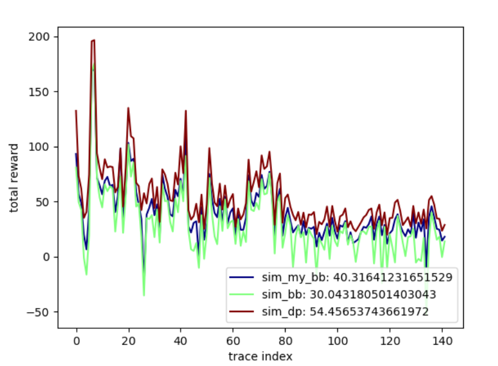

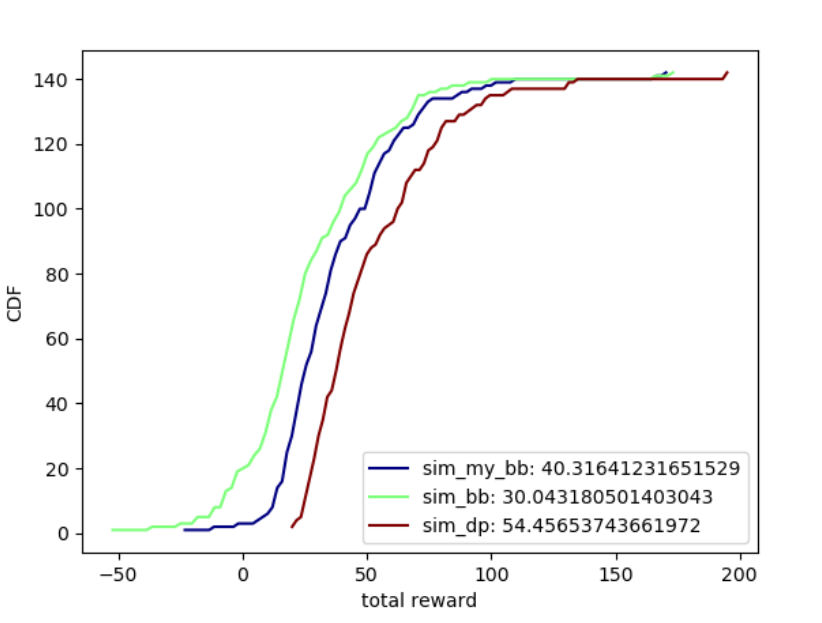 

* 一些可以看出显著优化效果的trace：经过优化后的BB减少了大量的比特率抖动，并且可以维持缓冲区始终处于较高的水平。

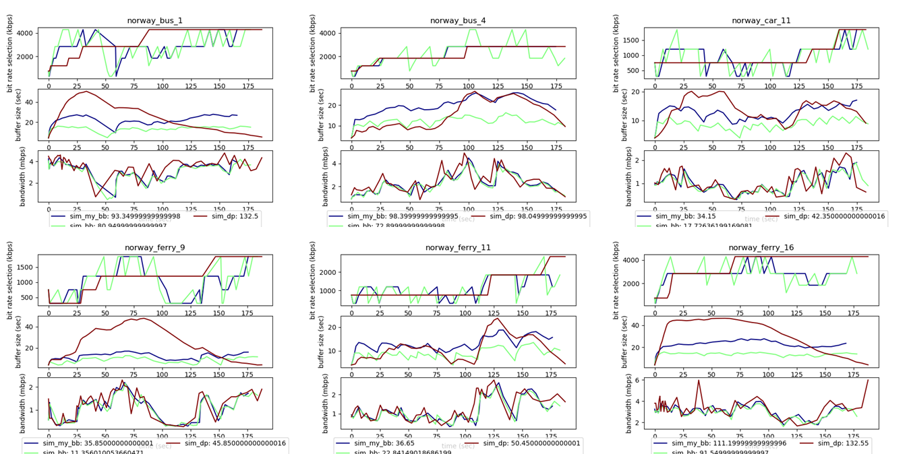

### MPC

* Reward效果比较：sim_dp, sim_mpc_pensieve, sim_mpc_naive, sim_mpc_optim, sim_mpc_lut, sim_bb：

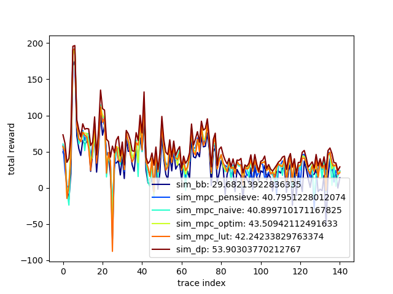

* 累积分布函数CDF曲线如下：

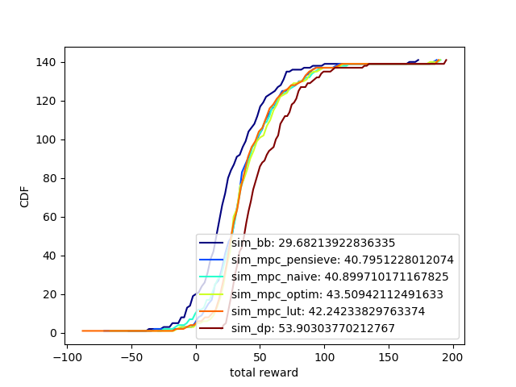


&emsp;&emsp;由于笔者电脑上没有安装tf环境，按照同学跑出的结果，MPC方法的相关指标已经超过了Pensieve方法。

* 运行时间比较：

|     版本     | BB方法 | Baseline | Ver. 1.0 | Ver. 1.1 | Ver. 2.0 |
| :----------: | :----: | :------: | :------: | :------: | :------: |
| **运行时间** | 0.54s  | 403.82s  | 404.75s  | 244.91s  |  0.76s   |

### Pensieve

* 下图结果中的BB和MPC分别为未经优化过的两种算法的原始版本。sim_rl是直接使用作者release code 在本地训练 20000 iteration 得到的模型（基本收敛，只有微小波动）。

<div>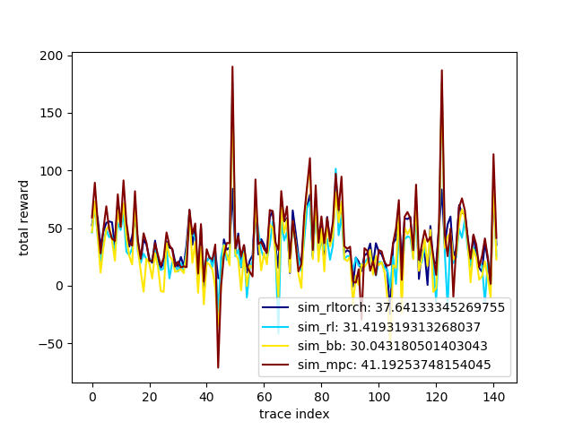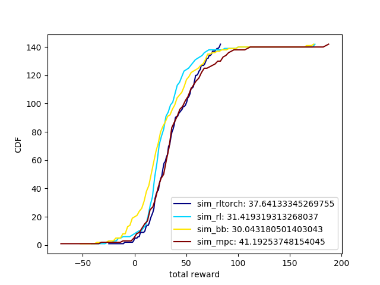</div>

* 在训练集不完整（只使用了dropbox上提供的traces）训练的情况下，我们优化的torch版本的a3c性能明显高于sim_rl。从cdf（右图）中可以看出，我们训练得到的rltorch版的结果方差很小，说明在不同的traces环境下的运行结果比较稳定，而不像 MPC 那样有很大的波动。可以看到典型的rltorch效果最好的traces下，RL-based 的方法会在带宽达到局部峰值时提高buffer size，提前进行码流的储备

<div>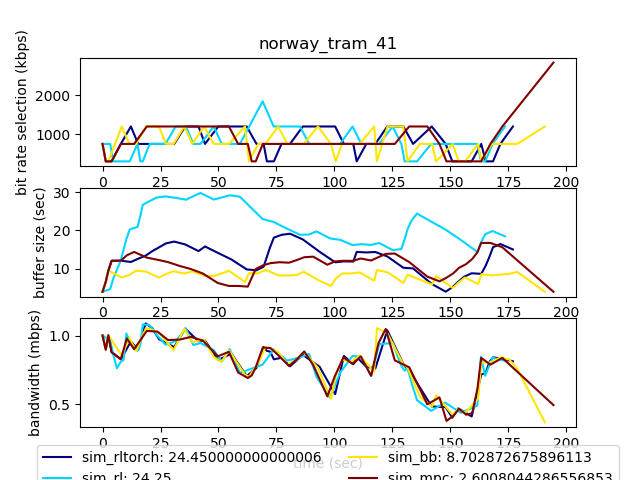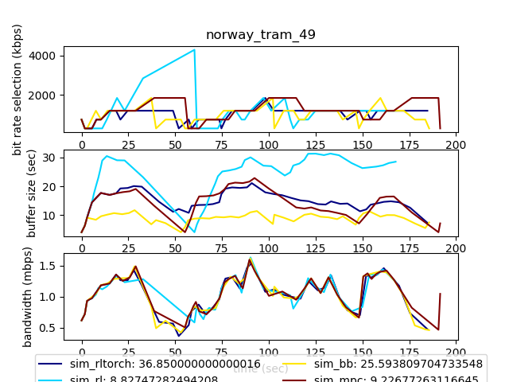</div>

* 而 lstm 的结果相对较差一些

<div>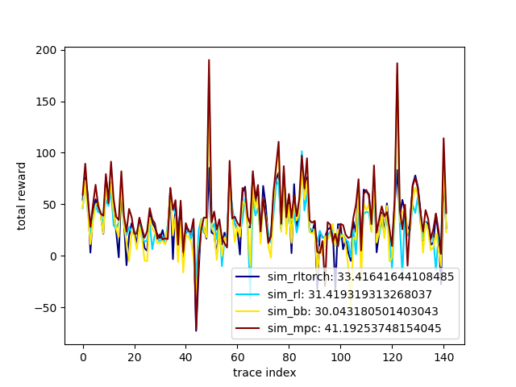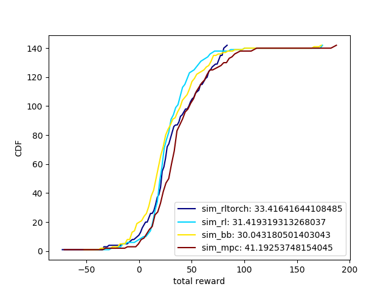</div>

<div>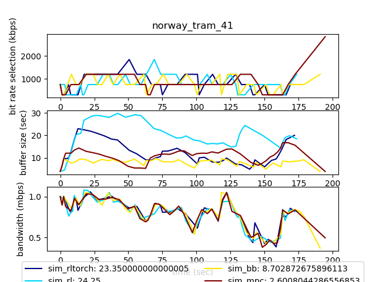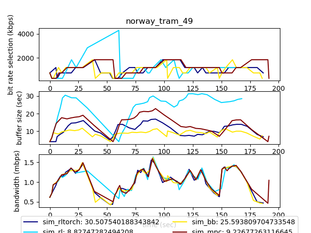</div>